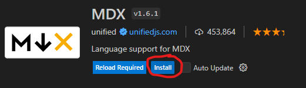

## Requirements
1. VSCode (Is included with WPILib)
    * [A GitHub account](../programming/github/Account.mdx)
    * [To be logged into VSCode with a GitHub account](../programming/github/Login.mdx)
2. [Git](../programming/github/Download.mdx)
3. VSCode MDX support plugin 
    * Locate the extensions tab.

        

    * Search for `MDX` by `unified`.
    * Click `Install`.

        

4. [Windows-nvm](https://github.com/coreybutler/nvm-windows/releases/latest), make sure to download `nvm-setup.exe`.
    * After restarting run `nvm install 21.5.0` then `nvm use 21.5.0` in a console/terminal.
5. Make sure to restart your computer after installing all of these softwares.