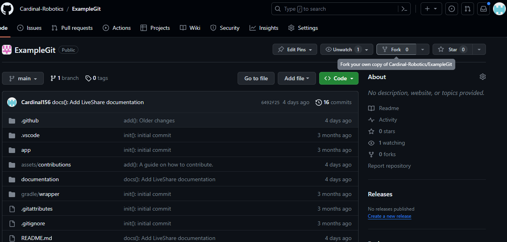
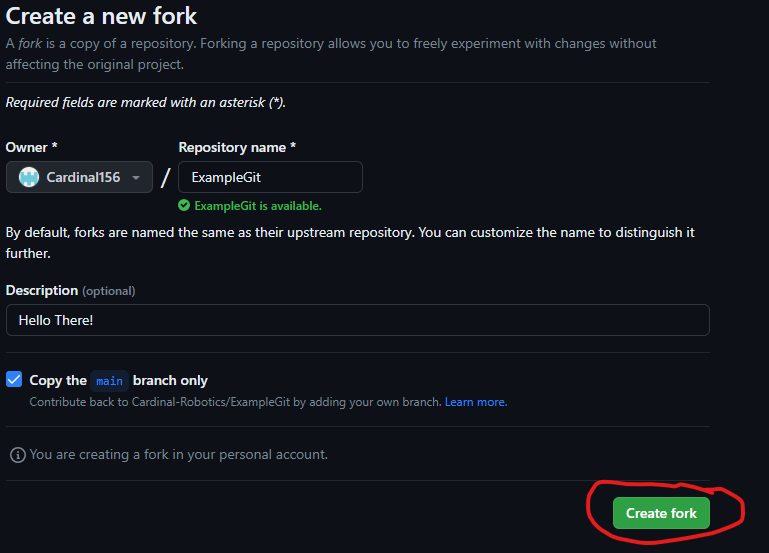

## Requirements:
1. [A GitHub Account](https://github.com/signup)
2. [Git](../download)

## Forks and branches, what are the difference?
Both forks and banches are very similar in function but are very different in purpose.

 * Forks allow people to make changes on a copy of a repository without bothering the owner every time someone wants to make a fork.
 * Branches are for working within the same repository, while working in different spheres.
 * Both forks and branches can submit pull requests, a way for the owners to review your changes and choose to accept or deny them however the key difference between them is that forks are seperate repositories while branches are still in within the same repository.
 * Due to the nature of forks, they require the project they extend to be public.
 * At St. Charles Robotics, most of our projects will be private and we will be utilizing branches instead of forks however for this example you will learn how to do both so you are prepared if you ever need to both.

## How to create a fork.
1. Find the repository you want to fork, this could be the [ExampleGit repository](https://github.com/Cardinal-Robotics/ExampleGit).
2. Press over the Fork button.

3. Press the "Create Fork" button.

4. Enjoy your wonderful fork!

## How to create a branch.
1. Make sure you have the repository cloned, this can be either on your fork or the official repository if you have membership premissions.
2. Open the project in VSCode, and open the terminal with (ctrl + \`).
3. Make sure you save all of your changes and push (upload) them all to GitHub or else you cannot make a new branch.
4. Let x be the name of your branch and run `git switch x`. The name of the branch cannot have spaces, or else git will interpret it as seperate parameters, <ins>please keep it all lowercase and only letters and numbers, no strange characters.</ins>