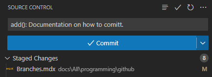

## Requirements
1. [A project that has been initialized with git.](../Init) (Repos cloned with `git clone` automatically have a `.git` folder)
2. [A GitHub account.](../Account)

## Staging
1. Make some changes to your code.
2. Open the `Source Control` menu on the left.

    

2. Click `Stage All Changes` (+ icon), think of this as the rough draft stage.

    

3. Write a comitt message, although you may be tempted to use a random name please give it an actual description. Personally I use `fix(): Removed issue with Swerve`, `clean(): Organize code into multiple functions`, and `add(): TankDrive` however this format isn't necessary. Having good comitt messages make it easier for not only others but for yourself to go back through the history and know what is changed without manually reviewing all of the changes.

    

4. Click `✓ Comitt`.

    