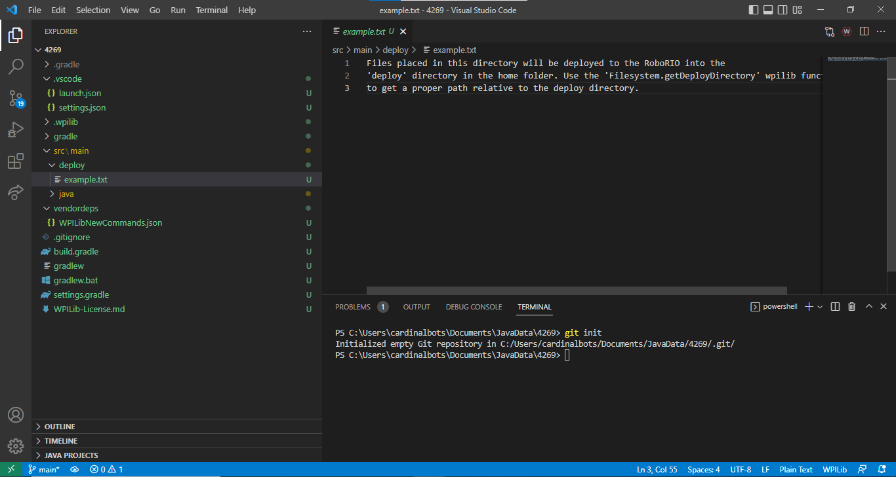
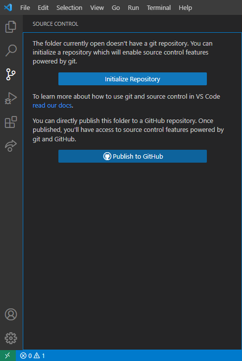

:::note
Skip to `put here later` if you have an existing repository on GitHub.
:::

## Methods
1. Git command
2. VSCode UI

## Git command
1. Open console (ctrl + \`)
2. Run `git init`

    

## VSCode UI
1. Open `Source Control` on the left.

    

2. Click `Initialize Repository`.

## How to publish to GitHub

Follow the [comitting changes guide].