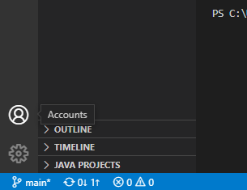
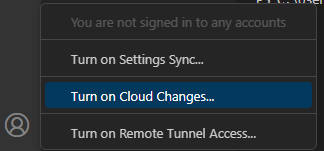
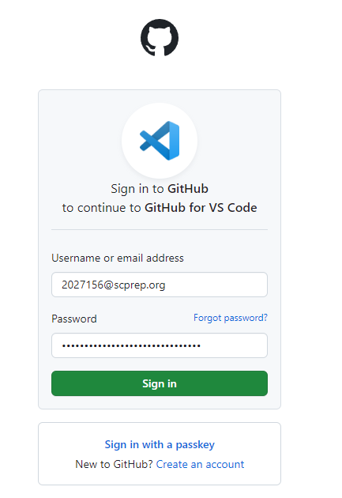
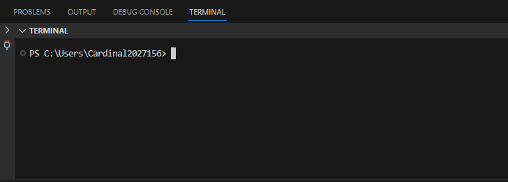
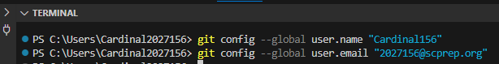

## Requirements
- [A GitHub Account](Account.mdx)
- WPILib's VSCode

## How to login into VSCode with a GitHub account.

1. Find the accounts section.

    

2. Select `Turn on Cloud Changes...`.

    

3. Select `Sign in with GitHub`.

    

4. Login to your account and press `Sign in`.

    

:::info
    You may be able to stop here, the following steps may be unecessary, if you cannot push or pull to GitHub because your username/email is not defined, please contiue.
:::

5. Open up the terminal in VSCode, the shortcut is ``(ctrl + \`)`` but you can also go to the Terminal tab at the top.

    

6. Then run these following commands, make sure to substitute the `{USERNAME}` with your GitHub username and the `{EMAIL}` with the email you used in your GitHub account (probably your `@scprep.org` email). Make sure to leave the quotes as is, do not remove them.
    ```cmd
        git config --global user.name "{USERNAME}"
        git config --global user.email "{EMAIL}"
    ```

    