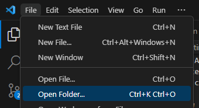

## Requirements
1. VSCode (Is included with WPILib)
    * [A GitHub account](../programming/github/Account.mdx)
    * [To be logged into VSCode with a GitHub account](../programming/github/Login.mdx)
2. [Git](../programming/github/Download.mdx)
3. VSCode MDX support plugin 
    * Locate the extensions tab.

        

    * Search for `MDX` by `unified`.
    * Click `Install`.

        

4. [Windows-nvm](https://github.com/coreybutler/nvm-windows/releases/latest), make sure to download `nvm-setup.exe`.
    * After restarting run `nvm install 21.5.0` then `nvm use 21.5.0` in a console/terminal.
5. Make sure to restart your computer after installing all of these softwares.
6. [A "clone" of this repository.](#how-do-i-clone-this-repository)

## How do I clone this repository?

1. Open a new VSCode instance.

2. Open its terminal using `` CTRL + ` ``

3. Run `cd C:\Users\cardinalbots\Documents\JavaData`

4. Then run `git clone https://github.com/Cardinal-Robotics/Documentation.git`, this will download a copy of the repository with git files already set up.

5. In the top left corner, find `File` and `Open Folder`.

    

6. Go to your `Documents` folder and open the folder called `Documentation`.