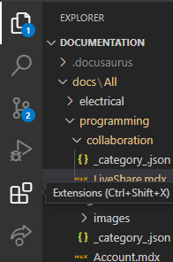
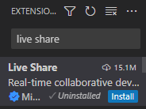
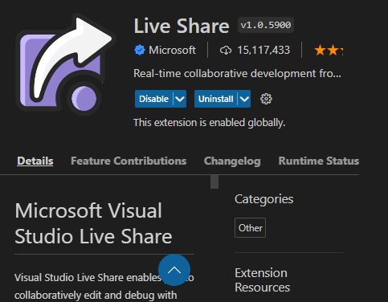
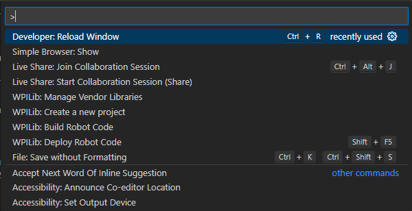
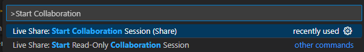
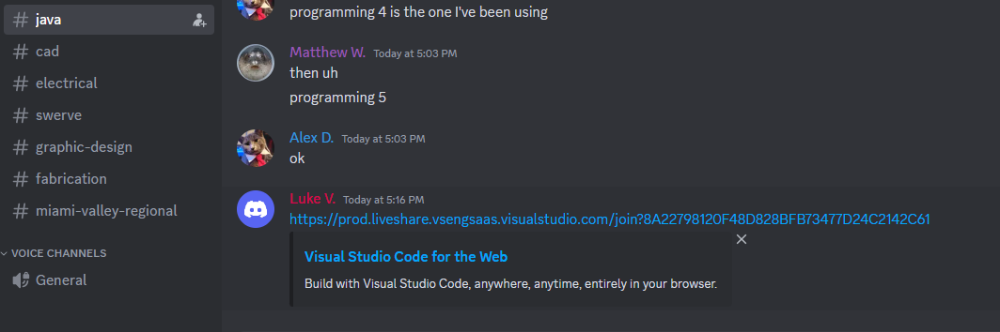
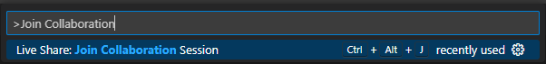
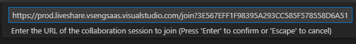

## What is LiveShare?

LiveShare is a VSCode plugin that allows people to connect to a host and share a project.

## Why would I need to use LiveShare?

LiveShare is useful for when two people are working on the same project at the same time. This method allows for less back and forth and potential merge conflicts on GitHub. Aditionally you can see what others are working on, making same-time collaboration easier.

## Requirements
- [A GitHub account](../github/Intro.mdx#how-do-i-make-a-github-account)
- WPILib's VSCode

## How do I install LiveShare?

1. Locate the Extensions tab in VSCode.

    

2. Search for `Live Share` in the Extensions tab.

    

3. Press `Install`, then click `Reload Required` if required.

    

## How do I use LiveShare?

### How do I host a sesion?
1. Open VSCode's quick menu `(Ctrl + Shift + P)`

    

2. Search for `Start Collaboration`.

    

3. The link to the LiveShare should automatically be copied to your clipboard. Now go to #java in the Discord guild (server), then paste and send the link.

    

### How do I join a session?

1. Obtain an invitation link from #java in the Discord guild.

    

2. Open VSCode's quick menu `(Ctrl + Shift + P)`

3. Search for `Join Collaboration`.

    

4. LiveShare should automatically obtain the URL from your clipboard, if it cannot pull it you will need to put it in there.

    