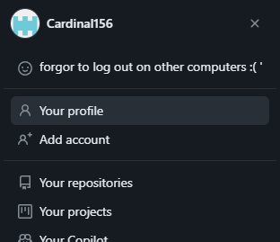
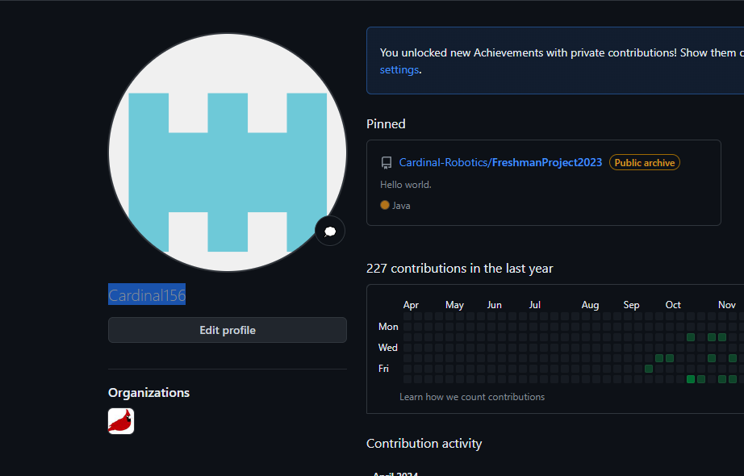
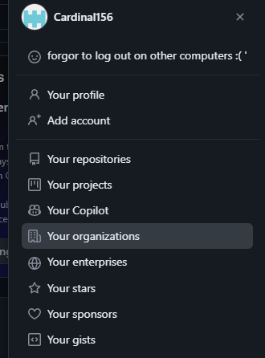
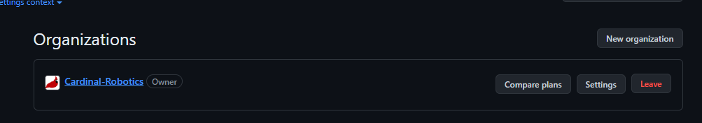
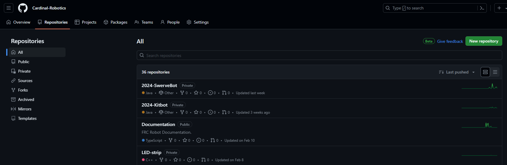

## How do I get added to the CardinalBots orginization?
1. Find the username of your GitHub account.
    1. Go to https://github.com.
    2. In the upper right corner, click on your round profile picture.
        
        

    3. Select `Your profile`.

        

    4. Your username will be here.

        

2. Contact an owner of our CardinalBots orginization. For example:
    * The programmers
    * The current team captain
    * Team mentors

3. Send them your username precisely and wait for them to send you an invite.

4. After you are invited, you should recieve an email. However, if you do not recieve one and are sure that the correct account has been invited, open https://github.com/orgs/Cardinal-Robotics/invitation.

## How do I find the CardinalBots orginization?
    1. Go to https://github.com.
    2. In the upper right corner, click on your round profile picture.
        
        

    3. Select `Your organizations`.

        

    4. Go to `Cardinal-Robotics`

        

## How do I find the code?
    1. Go to the repositories section of our orginization.
    2. Either search or manually scroll for what you need, the most recently updated repositories (the code is inside here) will be on top.

        