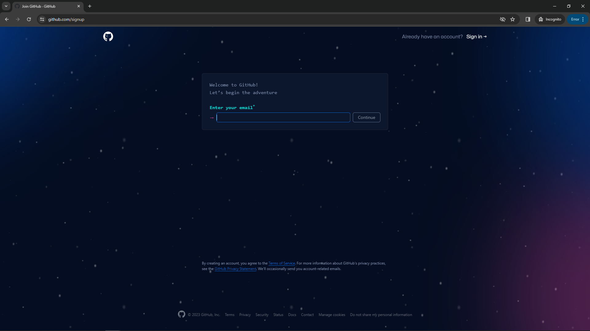
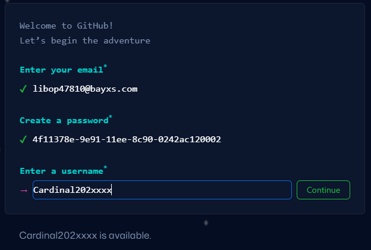
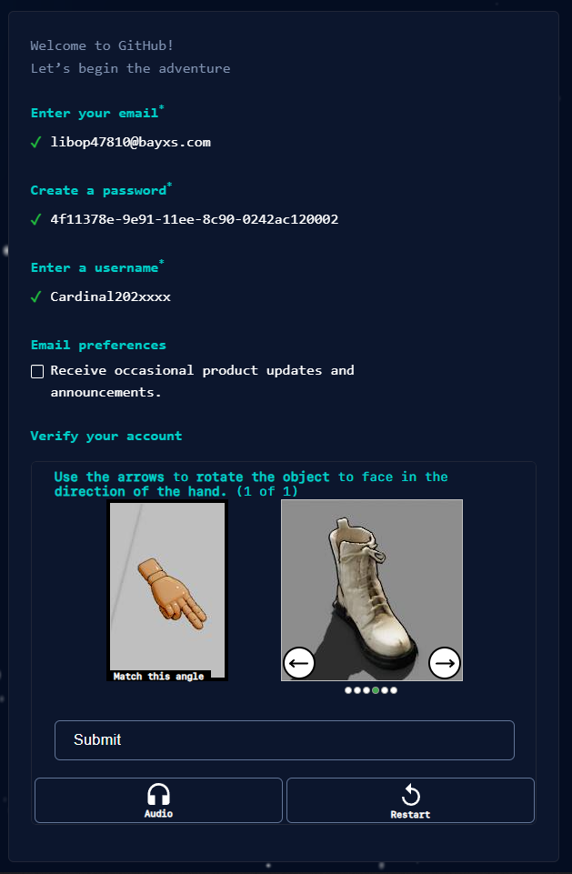

## How do I make a GitHub account?
1. Go to https://github.com/signup.

    

2. Enter your `202xxxx@scprep.org` email, then press `Continue`.

    

3. Create a unique password, then press `Continue`.

    

4. Pick a unique username, for example this could simply be your given email, after that press `Continue`.

    

5. Choose to accept or deny emails from GitHub, it is recommended to deny these.

    

6. Complete the given Captcha, then press `Continue`.

    

7. Press `Create account`.

    

8. Enter in the code sent to your email, and your account will be complete.

    