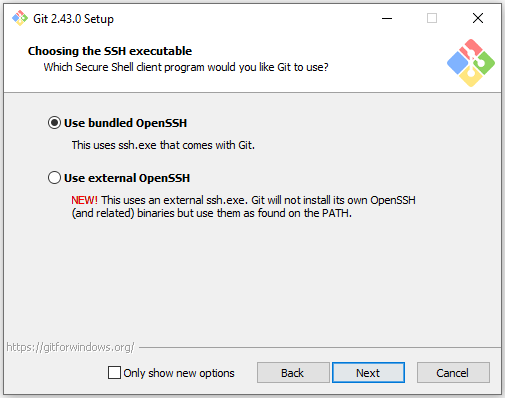
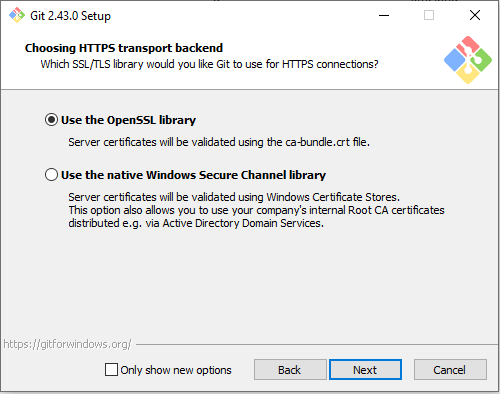
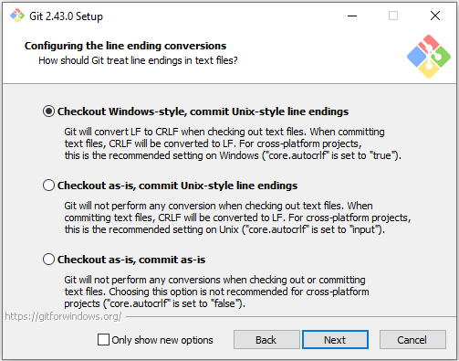
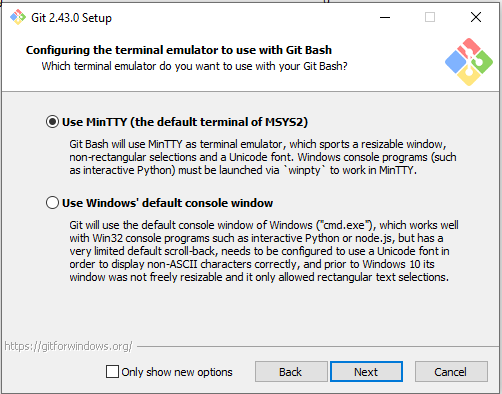
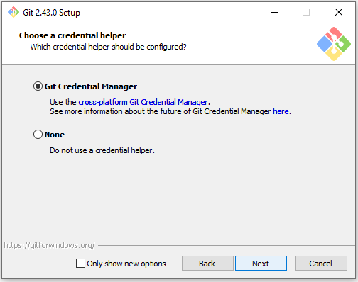
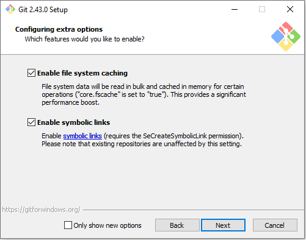
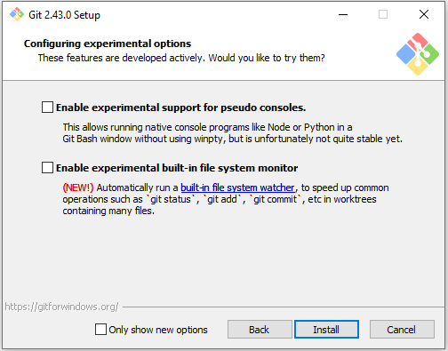

## How do I find Git's installer?
1. Go to Git's official download page, https://git-scm.com/download/win.
2. Press the first link, "Click here to download". The website should automatically detect which version of Windows you need to use.

## How do I set up Git?
1. Accept the license and press `Next`.

    

2. Accept the default configuration and press `Next`.

    

3. Open the dropdown and scroll down until you can `Select other editor as Git's default editor`.

    

4. Enter `C:\Users\Public\wpilib\2023\vscode\Code.exe` as the location of the custom editor. Then press `Next`.

    

5. Select `Override the default branch name for new repositories`, then press `Next`.

    

6. Leave this on the default option, the recommended one and press `Next`.

    

7. Leave these next settings on the default option and press `Next`.

    
    
    
    
    
    
    
    

8. Press `Install`.

    