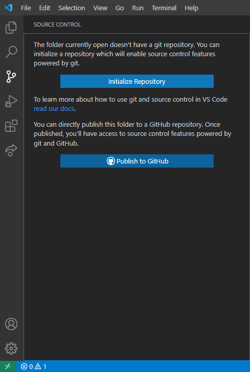

:::warning
If there is an existing repository on GitHub and you have changes on an unlinked copy, you will have to clone the repo on GitHub, manually bring over your changes to the cloned repo, work out the differences between the two, then upload the changes.
:::

## Methods
1. Git command
2. VSCode UI

## Create a repo through Git
1. Open the console ``(CTRL + `)``
2. Run `git init`

    

3. [Comitt and publish your changes](Comitting.mdx).

## Create a repo through VSCode's UI
1. Open `Source Control` on the left.

    

2. Click `Publish to GitHub`.
3. Select all wanted files then press Ok.
