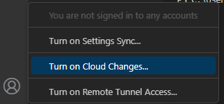

## What is Git, GitHub, and the difference between them?
Git is a version-tracking program, think of it as a shopping list. 
When you want to remove or add something, simply cross these things out then write down new things.
Its simply unecessary to create a new list everytime you want to make changes.

Git keeps track of individual changes rather than a new copy for each one, preventing unecessary use of file space.

While Git keeps a track of these changes, Git*Hub* stores those changes on the internet.
This enables team members to see your changes without moving the history from your computer to their computer everytime they need it. 

## Why use GitHub? Just store files normally.
GitHub makes version managing and collaborating easier. 

If you store files on your own computer, anyone who needs that code will have to confront you and transfer these files themselves every time.

Even if you use something like Google Drive or OneDrive, it doesn't allow you to see what the code used to look like.
You could make many folders such as `Project 0.0.1`, `Project 0.0.2`, and `Project 0.1.3` however all the minute details will be lost whenever you forget to upload the new version. 
Aditionally, this method takes up unecessary resources.
Uploading code to a cloud drive not only takes up a lot of redundant file space but also steals your time.
When you upload code to a cloud drive, you have to upload every single file, while with GitHub you only upload the small changes.

## How do I download Git?
1. Go to Git's official download page, https://git-scm.com/download/win.

2. Press the first link on the page, `Click here to download`. The website should automatically detect which version of Windows you need to use.

3. Accept the license and press `Next`.

    

4. Accept the default configuration and press `Next`.

    

5. Open the dropdown and scroll down until you can `Select other editor as Git's default editor`.

    

6. Enter `C:\Users\Public\wpilib\2023\vscode\Code.exe` as the location of the custom editor. Then press `Next`.
    :::info
        Make sure to replace `2023` with the year of your currently installed software.
    :::

    :::warning
        If you install new WPILib season software and have Git integration with your code editor you will need to reinstall Git and change the path to the new editor.
    :::

    

7. Select `Override the default branch name for new repositories`, then press `Next`.

    

8. Leave this on the default option, the recommended one, and press `Next` for all of the following steps.

    

9. Leave these next settings on the default option and press `Next`.

    
    
    
    
    
    
    
    

10. Press `Install`.

    

## How do I make a GitHub account?
1. Go to https://github.com/signup.

    

2. Enter your `202xxxx@scprep.org` email, then press `Continue`.

    

3. Create a unique password, then press `Continue`.

    

4. Pick a unique username, for example this could simply be your given email, after that press `Continue`.

    

5. Choose to accept or deny emails from GitHub, I recommended denying these but it is your choice.

    

6. Complete the given Captcha, then press `Continue`.

    

7. Press `Create account`.

    

8. Enter in the code sent to your email, and your account will be complete.

    

## How do I login to VSCode and Git with my GitHub account?

### Requirements
- [A GitHub Account](#how-do-i-make-a-github-account)
- WPILib's VSCode

1. Find the accounts section.

    

2. Select `Turn on Cloud Changes...`.

    

3. Select `Sign in with GitHub`.

    

4. Login to your account and press `Sign in`.

    

5. Open up the terminal in VSCode, the shortcut is ``(CTRL + `)`` but you can also use the `Terminal > New Terminal` at the top.

    

6. Run the following commands and <ins>substitute the `USERNAME`</ins> with your *GitHub username* <ins>and the `EMAIL`</ins> with your *GitHub account's email* (likely `@scprep.org`). Leave the quotes as is do not remove them.
    ```cmd
        git config --global user.name "USERNAME"
        git config --global user.email "EMAIL"
    ```

    The end result should look like this:
    